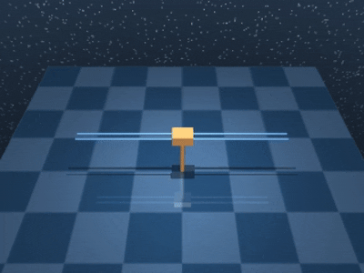
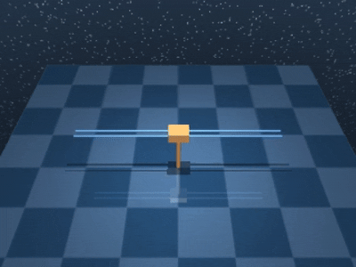
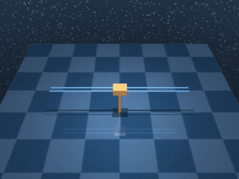
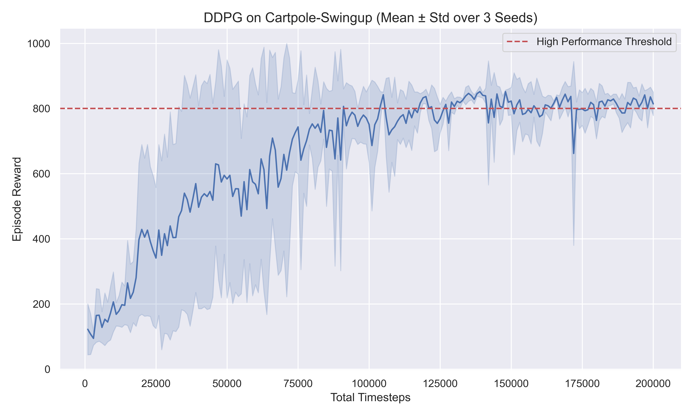

# 🤖 DDPG on CartPole-Swingup — Reinforcement Learning 

## 📘 Overview

This project trains a Deep Deterministic Policy Gradient (DDPG) agent on
the `dm_control` CartPole-Swingup task using Stable-Baselines3, Shimmy,
and Gymnasium wrappers. The objective is to swing the pole upward from
the hanging position and balance it upright using continuous torque
control. Training is performed across three different seeds, and the
final results include training logs, evaluation videos, and a minimalist
learning curve plot.

## 🧠 Algorithm: DDPG

DDPG (Deep Deterministic Policy Gradient) is an off-policy actor–critic
reinforcement learning algorithm designed for continuous action spaces.

It uses:

- 🎯 A deterministic actor network  
- 📉 A critic network to estimate Q-values  
- 🎲 Gaussian noise for exploration  
- 🔄 Target networks for stabilization  

DDPG is sensitive to noise and hyperparameters, which makes seed
comparison especially important.

## ⚙️ Training Setup

- Environment: `dm_control/cartpole-swingup-v0`
- Algorithm: DDPG
- Timesteps: ~200,000 per seed
- Seeds: `0`, `1`, `2`
- Noise: `NormalActionNoise` (σ = 0.1)

---

## 🎥 Evaluation Videos

A deterministic evaluation is performed using seeds **0, 1, 2**.  
The `RecordVideo` wrapper saves evaluation episodes as GIFs for preview.

### 1️⃣ Seed-0 Training  


### 2️⃣ Seed-1 Training  


### 3️⃣ Seed-2 Training  


---

## 📈 Learning Curve

A minimalist training curve is generated using Monitor logs.



---

## 📝 Performance Notes

DDPG learns the swingup task by:

1. ⚡ Exploring with noisy actions to build momentum  
2. 🌀 Discovering a trajectory that swings the pole upward  
3. 🎯 Using precise torque control to stabilize the pole  

DDPG performs decently but is generally less stable than SAC or TD3.

---

## 🚀 Running Training

```bash
python Train.py

```

## Running Evaluation

``` bash
python Evaluate.py
```


## Dependencies

    gymnasium
    shimmy
    dm_control
    stable-baselines3
    moviepy
    pandas
    matplotlib
    seaborn

## Summary

This project demonstrates a complete reinforcement learning pipeline for
continuous control: - Training a DDPG agent
- Logging results for multiple seeds
- Recording evaluation videos
- Plotting a clean learning curve
